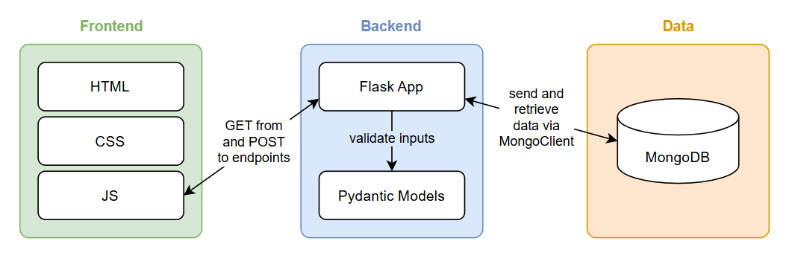
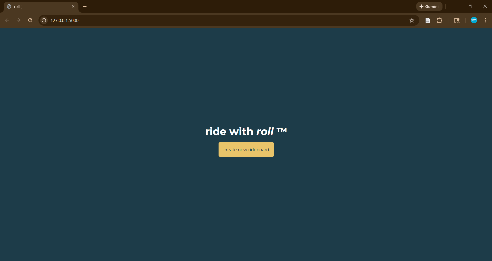
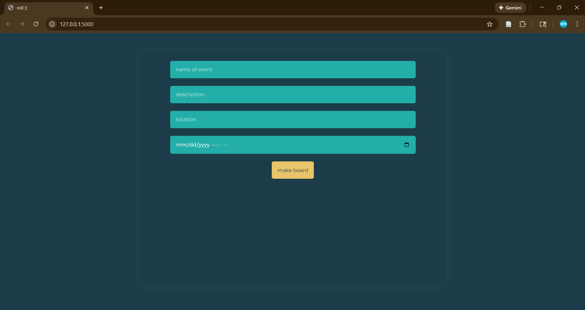
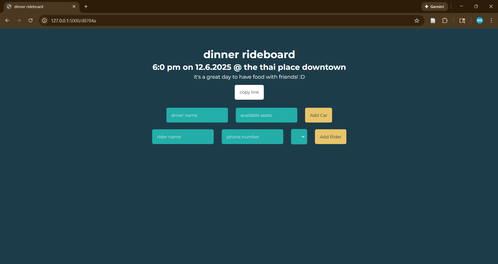
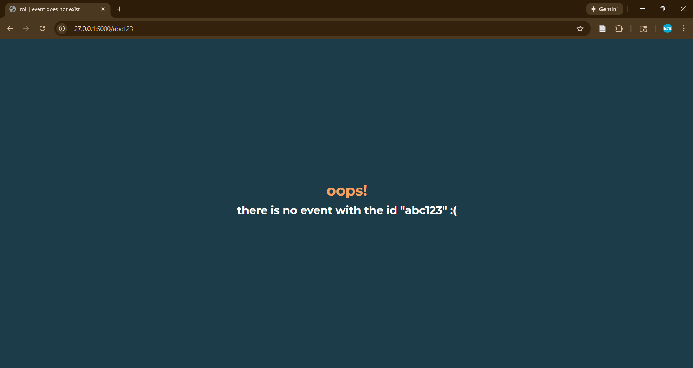
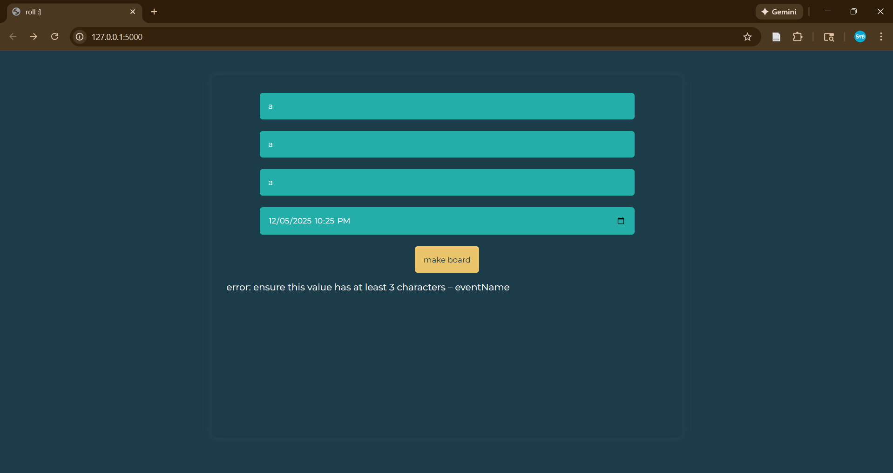

# 🚙 roll

## ⭐ Executive Summary

### ❔ Problem

_It's a busy world out there! There's things to do, places to be, people to see, and more... but! it's better when it's done together._

Carpooling is the manifestation of this. In many contexts, but especially in college, many people have a place to be but not all of those people have a car. Carpooling helps them get where they need to go more efficiently. To coordinate this, college students will often create "rideboards." These are usually just spreadsheets. It works, but it's not the best system for a few reasons:

* __Someone has to make the board:__ Whether it's someone who haphazardly throws it together or someone who spends a whole third-hour on it, someone has to make the board. They have sit down and make a spreadsheet and add headers and type up everything.
* __The formatting varies:__ Because a different person makes the board everytime, it always turns out different. Sometimes passengers have to put their phone number, sometimes they don't, sometimes they have to put their pickup location, sometimes they don't, etc.
* __The link is long and not guaranteed to work:__ A spreadsheet link is something like "https://docs.google.com/spreadsheets/d/234w5sb8hcyjagsfjk12jgk-jn391o2i256351hndh21yy3989213/edit?usp=sharing" which is long and unwieldy. The permissions on the sheet might also be set incorrectly, so the link might have to be edited and fixed.

### ✔️ Solution

_roll_ is a website that makes creating rideboards simple and easy. Creating a rideboard for an event is a breeze — just fill out a few fields and click a button! Each event has its own page with a shareable link in the form `something/######` where the `something` is where the website is running (eg. 120.0.0.1) and `######` is a unique, alphanumeric id. On that page, users can add and delete cars and riders as necessary, as well as see all existing cars and riders.

## 🛠️ System Overview

### 🧰 Course Concepts

_roll_ makes use of the following course concepts:

* GitHub version control
* Docker containerization
* Flask app creation
* NoSQL data in MongoDB
* Pydantic data validation

### 📐 Architecture Diagram

### 🗃️ Data / Models / Services

Data in _roll_ is stored in a MongoDB database. All events are stored in one container. Each `event` is a document with the following information:

* name
* description
* location
* datetime
* hash and unique id
* cars

The `cars` for an event is an array of documents, each of which have:

* driver name
* total number of seats
* current number of filled seats
* riders

The `riders` for an event is also an array of documents. Each rider document has:

* rider name
* rider phone number

The data is created when users create events and is thus of variable size. All data is kept private.

## ▶️ How to Run (Local)

### 📦 Docker

_roll_ is available as a public Docker image at [this Docker Hub repository](https://hub.docker.com/repository/docker/cvv8cb/roll/general). To run the image, execute the following command:

` docker run -it --rm  -p 8080:8080 --env-file <env-file> cvv8cb/roll:latest`

where `<env-file>` is replaced with the name of your env file, for example `.env`. See `.env.example` for how this file should look.

## ✒️ Design Decisions

### 💭 Why these Concepts

I chose to use Flask to create my app because of its simplicity and straightforwardness. I had to create quite a few endpoints, and Flask made that easy. The fact that it works in Python was also good because MongoDB works with Python; they could integrate together well.

I chose to use Pydantic to validate my data because of how versatile it can be. Admittedly, for the simple input validation I had, I probably could have used the built in functionality of HTML (ie. the `max ` and `min` attributes of `<input>` elements). However, using Pydantic gave me an opportunity to learn more about it and the potential for more development in the future. One specific opportunity it provides is more in-depth phone number validation.

I chose to store my data in MongoDB because of its flexibility and readability. SQL data is something I'm familiar with, but I wanted to store everything together, as opposed to multiple tables referencing one another. So, I chose to use MongoDB documents. Mongo also worked well with Flask and Pydantic since everything was in Python.

### 🔁 Tradeoffs

One tradeoff of using MongoDB is that accessing the nested documents is a pain. This can be seen in the functions to add and remove riders. Additionally, if a driver exists across multiple rideboards, there will be two entries of that driver; this has the potential to unnecessarily overload the data storage in the future. However, the benefit gained in the Mongo storage is that everything for one event (ie. one rideboard) is consolidated in one place.

Additionally, as mentioned previously, the Pydantic validation is more complex than just using HTML features. However, it is also more maintainable and extendable. Its complexity is useful for the future.

### 🔒 Security / Privacy

There is only one secret for this project, which is the connection string for the MongoDB database. This is stored as an environment variable, inaccessible to regular users and set at runtime. Additionally, only certain IP addresses are allowed to access it. Inputs are validated using Pydantic so they are not too long. Personally-identifiable information is stored in the private MongoDB database.

### ⏱️ Ops

Making a rideboard and adding drivers and riders is very fast and does not take long at all. This could become slower, though, if an event has a large number of cars. Each car is limited to a maximum of 15 riders, but each event can have an unlimited number of cars. Future development can look into optimizing the functionality.

## Results & Evaluation

### 😊 Sample Outputs

There are three types of pages within _roll_: the homepage where users can create a rideboard, an event page where users can view and edit a rideboard, and an event DNE page that shows when a user tries to a view an rideboard that does not exist. These are shown below.

_Home Page_

_Event Page_

_Event DNE Page_

### 🗒️ Performance Note

Whenever a new car or rider is added, the HTML is completely nixed and all the cars are added again. This could potentially be slowed by user internet speed and/or a large number of cars and riders.

### ☑️ Validation Tests

As mentioned, inputs are validated using Pydantic. Below is an image of what happens when someone tries to enter an input that doesn't follow the model.

## 🔮 What's Next

### 🎨 Planned / Potential Improvements

Right now, _roll_ is not perfect for a couple reasons:

* Phone numbers are not properly validated. Instead of using Pydantic's phone number features, it just treats the number as an integer and makes sure it is the right amount of digits.
* Event ID's are the first six character of a hash of the event name, description, time, etc. These are all values that can change, so I probably want to figure out something better to base the hash off of. Also, there is a chance that the first six characters are the same even if the whole hash isn't the same.
* Despite my efforts, the app is not publicly deployed — so nobody can really use it right now. I tried very hard to deploy it using both Azure and Render, but I couldn't get it to work.

Those are functionality things, but that isn't all that I want to add. Here are some things that I'd like users to be able to do, for fun and for increased usefulness:

* edit event, rider, and driver details
* add more details (eg. event category, rider pickup location, driver car description)
* add an event to Google Calendar
* minimally sign in (like when2meet)
* quick export rider phone numbers (so drivers can make group chats easily)
* add riders to a waitlist if all cars are full
* change color scheme and favicon of rideboard

Ideally, I will continue to develop this into a fully fledged app.

## 🔗 Links

[Github Repository](https://github.com/syd-nguyen/roll)

[Docker Repository](https://hub.docker.com/repository/docker/cvv8cb/roll/general)